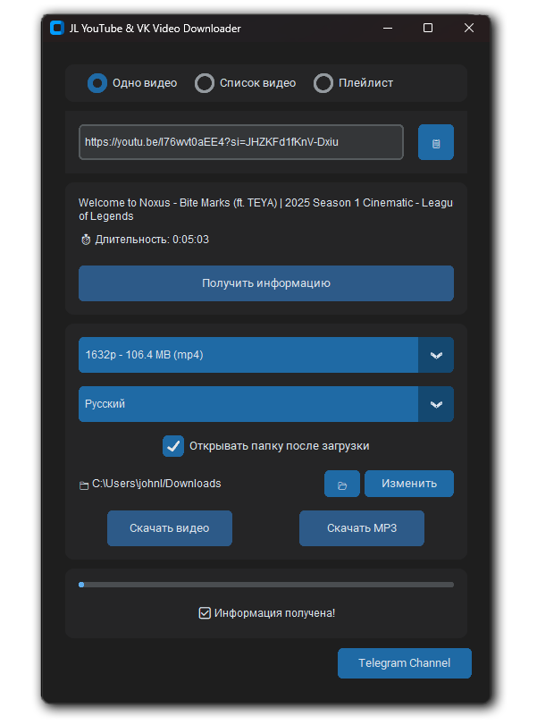

# JL YouTube & VK Video Downloader

A convenient video downloader that allows you to download content from YouTube and VK. Supports various video formats, language version selection, and MP3 conversion.

[🇷🇺 Русская версия](README_RU.md)

## Features
- Download videos from YouTube and VK
- Support for various video formats (up to 4K)
- Language version selection for YouTube videos
- Bulk download of multiple videos
- YouTube playlist download
- MP3 conversion
- User-friendly graphical interface
- Save videos with titles in selected language
- Automatic language detection
- Auto-open folder after download
- Work with URL lists (load/save)
- Portable version (no installation required)
- Automatic updates check and update system

## Quick Start
1. Download the latest version: [JL YouTube & VK Video Downloader v1.3.1](https://github.com/John-LapTev/jl-youtube-vk-downloader/releases/download/v1.3.1/JL.YouTube.VK.Video.Downloader.v1.3.1.exe)
2. Run the program
3. Paste video URL
4. Click "Get Info"
5. Select quality and language
6. Click "Download Video"

## Documentation
Detailed documentation is available in multiple languages:
- [English Documentation](docs/en/GUIDE.md)
- [Contributing Guide](docs/en/CONTRIBUTING.md) 
- [Change Log](docs/en/CHANGELOG.md)

## For Developers
⚠️ **Important**: If you want to work with source code:
1. Clone the repository
2. Extract `RUS_BAT.zip` to the project root folder (BAT files are stored in archive to preserve correct encoding)
3. Run setup.bat to prepare environment
4. See [Contributing Guide](docs/en/CONTRIBUTING.md) for details

## Technical Details
- Python 3.10
- yt-dlp 2024.12.23
- customtkinter 5.2.1
- ffmpeg latest version
- Program Version: 1.3.1

## Author
John LapTev (Telegram: [@JL_Stable_Diffusion](https://t.me/JL_Stable_Diffusion))

## License
MIT License. See [LICENSE.md](LICENSE.md) for details.